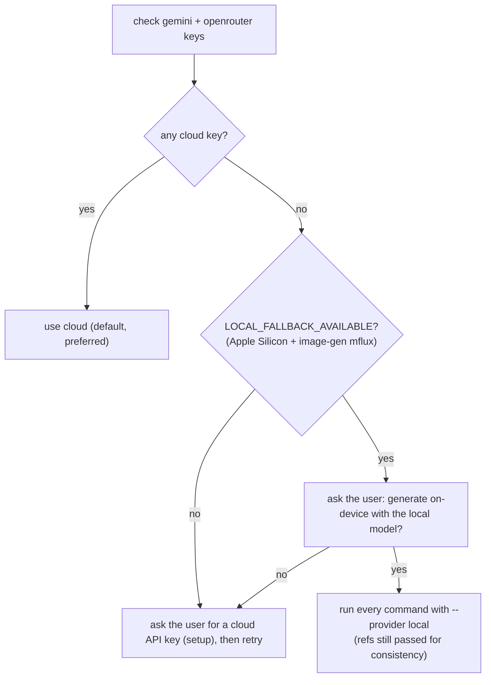

# ForwardPath Mobile UI

Two deliverables from one SOW, for an **Expo SDK 54 + React Native** mobile app:

1. **A grounded screen spec** (`MOBILE_APP_SCREENS_SPEC.md`) — brand foundation + every required screen, grounded **only** on the SOW and on Expo SDK 54 capabilities.
2. **Premium UI mockups** — one consistent, portrait phone image per screen, via Google Gemini.

This skill is self-contained: it does not depend on any other skill. PDF/report generation is out of scope.

## Hard rules
- **Ground on the SOW.** Depict and spec only SOW-documented mobile capabilities. Never invent features. List anything inferred under an Appendix and exclude it from mockups unless the user confirms.
- **Mobile only.** Web admin, client portals, dashboards and back-office are out of scope.
- **Expo SDK 54 feasible.** Every feature must map to a real Expo SDK 54 capability — see [`EXPO_SDK_54.md`](EXPO_SDK_54.md). Flag anything needing a development build or that isn't feasible.
- **Show your work.** After each mockup, display it with the Read tool.

## Setup (once per machine)

Dependencies:
```bash
pip install Pillow              # always required
pip install google-genai       # only for --provider gemini (default)
```
The `openrouter` provider needs no extra package (it uses the Python stdlib).

**Provider.** The tool renders through one of three backends, selected with `--provider` (or the `MOBILE_UI_PROVIDER` env var, or the stored default):
- `gemini` (default) — Google Gemini API directly. Key from https://aistudio.google.com/apikey (`GEMINI_API_KEY` / `GOOGLE_API_KEY`).
- `openrouter` — OpenRouter's OpenAI-compatible API. Key from https://openrouter.ai/keys (`OPENROUTER_API_KEY`). `image_config` (aspect ratio + size) is forwarded to Gemini image models, so portrait control is preserved. Pass `--provider openrouter` to **every** command below.
- `local` — **on-device fallback, no API key.** Reference-capable FLUX.2 Klein Edit (or Qwen-Image-Edit) run through the separately-installed [`image-gen`](../image-gen) skill's `mflux` CLIs. Apple Silicon only. Cloud stays preferred; only use `local` when there's no cloud key **and** the user consents — see [No cloud key? On-device fallback](#no-cloud-key-on-device-fallback). Needs `image-gen` set up once: `bash <image-gen>/scripts/setup_env.sh`.

Set `TOOL` to the absolute path of `scripts/mockup_gen.py` **inside this skill's own directory** (the folder this `SKILL.md` lives in — wherever the skill was installed, e.g. `.cursor/skills/`, `.claude/skills/`, or `.agents/skills/`). Reuse this `$TOOL` for every command below.

API key — check, and if missing, **ask the user** for the chosen provider's key, then store it. Pass the key via **stdin** (not `--api-key`) so it never appears in `ps`/`/proc`:
```bash
TOOL="<this skill dir>/scripts/mockup_gen.py"
python "$TOOL" check                               # add --provider openrouter to target that backend
# If NOT_CONFIGURED, ask the user for the key, then store it via stdin:
printf '%s' "USER_KEY_HERE" | python "$TOOL" setup            # gemini (default)
printf '%s' "USER_KEY_HERE" | python "$TOOL" setup --provider openrouter
# Alternatively, skip setup entirely and export GEMINI_API_KEY (or OPENROUTER_API_KEY).
```
Keys persist per provider at `~/.config/mobile-ui/config.json`. If any call prints `NO_API_KEY`, ask the user for a key and run `setup`, then retry. Never hardcode a key.

### No cloud key? On-device fallback

When the user has **no** Gemini/OpenRouter key, this machine can generate mockups fully offline — but only on an Apple Silicon Mac, and only with the user's consent. The generator never falls back silently: `local` runs solely via an explicit `--provider local`. Follow this flow:



1. Run `python "$TOOL" check`. It prints the cloud key status **and** a `LOCAL_FALLBACK_AVAILABLE` / `LOCAL_FALLBACK_UNAVAILABLE (reason)` line.
2. If no cloud key but `LOCAL_FALLBACK_AVAILABLE`, **ask the user** (via the chat, e.g. the question/approval UI) whether to generate on-device. Explain the trade-offs honestly (below). Only proceed on a yes.
3. On consent, add `--provider local` to **every** `generate`/`regenerate` call. Keep passing the same `--colors`, `--style`, `--description`, and `--refs` — references are forwarded to the edit model (`--image-paths`), so cross-screen consistency is preserved.
4. Optionally persist it as the default: `python "$TOOL" setup --provider local` (no key needed; `--local-model flux2-klein-4b|qwen-image-edit` to pin the engine).

The engine auto-picks: **Qwen-Image-Edit** if its weights are already cached, otherwise **FLUX.2 Klein Edit** (`flux2-klein-4b`, the lighter default). First run downloads weights (~12 GB free needed) into the shared HF cache.

**Honest limitations of the local path** (tell the user):
- References **are** used, so brand/chrome consistency holds up far better than plain text-to-image — but still below Gemini's reference fidelity, and an edit model can drift on complex layouts.
- Diffusion renders small UI text less crisply than Gemini. It's a solid "better-than-nothing" fallback, not a Gemini replacement.
- Slower (on-device), and needs the `image-gen` skill installed on Apple Silicon.

**analyze / modify-json with no cloud key.** In local mode these default to **agent-native** — the fastest, highest-quality path: running `analyze`/`modify-json --provider local` prints a `LOCAL_ANALYZE_AGENT_NATIVE` / `LOCAL_MODIFY_AGENT_NATIVE` directive, and **you (the agent) then read the mockup with the Read tool and write/edit the JSON yourself** (no model download, fully offline). Only add `--vlm` if a scripted, offline model is required instead of doing it inline — that needs a one-time `bash "$(dirname "$TOOL")/setup_vlm.sh"` (creates a shared `~/.ui-vlm` venv; default VLM `Qwen2.5-VL-3B`, override with `--vlm-model`).

---

## Phase 1 — SOW → grounded screen spec

Copy this checklist and track it:
```
- [ ] 1. Ingest the SOW
- [ ] 2. Extract brand entities + brand foundation
- [ ] 3. Map required mobile features to Expo SDK 54
- [ ] 4. Enumerate required screens (grounded)
- [ ] 5. Write MOBILE_APP_SCREENS_SPEC.md from the template
```

**1. Ingest the SOW.** Accept a URL or a file. For a URL, fetch it; if it's JavaScript-rendered (e.g. Notion) and comes back empty, use a browser tool to navigate and read the rendered text. Capture objectives, scope, roles, features, data, integrations, constraints, and phasing.

**2. Extract brand entities + brand foundation.** Identify the entities named in the SOW (the client/company the app is for, its parent group, key partners/retailers). Research those entities' brands (logo, colors, typography vibe, naming conventions) using web tools, and define a brand foundation: color tokens, typography, layout/shape, motion. Capture naming/wordmark rules (e.g. preferred shorthand). This becomes §1 of the spec.

**3. Map features to Expo SDK 54.** For each mobile capability in the SOW (auth/SSO, camera/capture, OCR/CV, offline storage, background sync, connectivity, notifications, etc.), pick the Expo SDK 54 path from [`EXPO_SDK_54.md`](EXPO_SDK_54.md). Note dev-build needs and anything not feasible.

**4. Enumerate required screens.** Derive the minimal set of mobile screens needed to deliver the SOW, in **usage order** (first-run → core loop → results → account). Each screen must trace to a SOW section (or be marked `implied`/`inferred`).

**5. Write the spec.** Create `MOBILE_APP_SCREENS_SPEC.md` using [`SPEC_TEMPLATE.md`](SPEC_TEMPLATE.md): brand foundation, information architecture, screen inventory table, and a definition block per screen (purpose, layout, components, states, primary action, low-cognitive-load notes, Expo SDK 54 mapping, SOW basis). Include the grounding rule and an Appendix of inferred/out-of-scope items.

Confirm the spec with the user before generating mockups.

---

## Phase 2 — generate the UI mockups

Tool: the `$TOOL` set in Setup (`scripts/mockup_gen.py` in this skill's directory). Prompting and the project-file format are in [`MOCKUP_PROMPTING.md`](MOCKUP_PROMPTING.md).

```
- [ ] 1. Create .forwardpath-ui-project.json (brand, colors, style, render)
- [ ] 2. Generate screens one at a time, in usage order, into mockups/
- [ ] 3. Pass brand palette + style + ALL prior screens as refs each time
- [ ] 4. Show each result; record it in the project file
- [ ] 5. Audit the full set against the SOW
```

**1. Project file.** Write `.forwardpath-ui-project.json` at the workspace root (format in [`MOCKUP_PROMPTING.md`](MOCKUP_PROMPTING.md)) so every generation reuses the same brand inputs.

**2–4. Generate consistently.** One screen per call, in usage order, saved as `mockups/NN-screen-name.png`:
```bash
python "$TOOL" generate \
  --prompt "<screen identity, theme, layout top→bottom, real labels, primary action, what to omit>" \
  --theme dark \
  --colors "<palette from project file>" \
  --style "<style from project file>" \
  --description "<brand context from project file>" \
  --refs mockups/01-*.png mockups/02-*.png logo.png \
  -o mockups/03-<name>.png
```
Always pass `--colors`, `--style`, `--description`, and previously generated screens via `--refs` for one-product consistency. Defaults are portrait `9:16`, `2K`, `iphone` frame (override with `--frame android|none`, `--aspect`, `--size`). Show each image with the Read tool and append it to the project file's `screens` array.

**5. Audit.** Re-check every mockup against the SOW (no invented features) and Expo SDK 54 feasibility. Regenerate any drift (retry once; if needed lower `--temperature` or simplify).

### Editing an existing mockup (optional)
Use the 3-step flow: `analyze` → `modify-json` → `regenerate` (keeps layout, applies only requested changes). See script `--help`. With `--provider local`, `analyze`/`modify-json` are agent-native by default (you read the image and write the JSON), while `regenerate --provider local` re-renders on-device, forwarding `--original` + `--refs` to the edit model.

---

## Command reference
Every command accepts `--provider gemini|openrouter|local` (default `gemini`). For `local`, the engine auto-picks Qwen-Image-Edit if cached else `flux2-klein-4b` (force with `--model flux2-klein-4b|qwen-image-edit`); no key is required.
```bash
python "$TOOL" check [--provider gemini|openrouter|local]   # also prints LOCAL_FALLBACK_AVAILABLE/UNAVAILABLE
printf '%s' KEY | python "$TOOL" setup [--provider gemini|openrouter] [--generation-model M] [--analysis-model M]
python "$TOOL" setup --provider local [--local-model flux2-klein-4b|qwen-image-edit]   # no key needed
python "$TOOL" generate --prompt "..." -o out.png [--provider ...] [--model ...] [--refs ...] [--colors ...] [--style ...] [--description ...] [--theme light|dark] [--frame iphone|android|none] [--aspect 9:16] [--size 1K|2K|4K] [--temperature 0.35]
python "$TOOL" analyze image.png [-o spec.json] [--provider ...] [--vlm] [--vlm-model M]
python "$TOOL" modify-json --json-file spec.json --changes "..." [-o spec2.json] [--provider ...] [--vlm] [--vlm-model M]
python "$TOOL" regenerate --json-spec spec2.json [--original image.png] [--refs ...] -o out.png [--provider ...]
```
With `--provider local`, `analyze`/`modify-json` are agent-native by default (they print a directive; you write the JSON). `--vlm` runs a fully-offline model instead and needs a one-time `bash "$(dirname "$TOOL")/setup_vlm.sh"`.

## Resources
- [`EXPO_SDK_54.md`](EXPO_SDK_54.md) — capability → package map + grounding constraints.
- [`SPEC_TEMPLATE.md`](SPEC_TEMPLATE.md) — the screen-spec Markdown template.
- [`MOCKUP_PROMPTING.md`](MOCKUP_PROMPTING.md) — prompt construction + `.forwardpath-ui-project.json` format.
