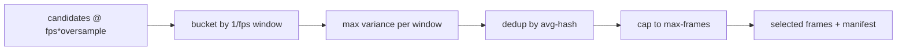

# Review MP4 — Reference

Detailed background for [SKILL.md](SKILL.md): how blur detection works, how frames are selected, the ffmpeg/curl commands, the manifest schema, and the temp/TTL design.

## Blur detection: variance of the Laplacian

The Laplacian operator highlights rapid intensity changes (edges, detail). A sharp image has strong edges, so its Laplacian has a **wide spread of values** (high variance); a blurry image has weak edges, so **low variance**. We score each frame by the variance of its Laplacian and treat higher as sharper.

The Laplacian is a 3x3 convolution kernel:

```
0  1  0
1 -4  1
0  1  0
```

Backends:

- **opencv** (Python, if `cv2` importable): `cv2.Laplacian(gray, cv2.CV_64F).var()`.
- **numpy** (Python default, Pillow + numpy): grayscale to a float array, then the discrete Laplacian on interior pixels via slicing — `-4*c + up + down + left + right` — and `.var()`.
- **sharp** (Node): `sharp(p).greyscale().raw().convolve(kernel).toBuffer()`, then the variance of the bytes. This is the approach from [the LinkedIn article](https://www.linkedin.com/pulse/pinpointing-blurry-images-simple-nodejs-way-pablo-schaffner-bofill/).

### Thresholds

Absolute variance values depend on the backend and the content, so they are **not** comparable:

- The numpy backend works in float space (unclamped second derivatives) — values run large; the default floor is `8.0`.
- The opencv backend (float, `CV_64F`) typically runs larger still; default floor `100.0`.
- The sharp backend convolves **clamped 8-bit bytes**, so values are compressed; default floor `4.0`.

Because of this, selection is primarily **relative**: within one run we keep the sharpest frame in each time window. `--threshold` is only an absolute gate used to **flag** a window's best as `blurry` (or drop it with `--skip-blurry`). Tune `--threshold` per source if you rely on the flag; never compare `sharpness` across runs, videos, or backends.

## Selection algorithm

Given target `--fps` (window size `1/fps`) and `--oversample`:

1. **Extract** candidates at `fps * oversample` frames/sec, so each target window has several candidates. This is what lets a blurry pick fall back to an in-focus neighbor.
2. **Score** every candidate's variance-of-Laplacian.
3. **Window**: bucket candidates by `floor(t / window)`; in each window keep the **max-variance** candidate. Flag it `blurry` if below `--threshold`.
4. **Dedup**: drop consecutive selections whose 8x8 average-hash Hamming distance is `<= --dedup-dist` (default 4), keeping the sharper one — avoids many near-identical frames in static stretches.
5. **Cap**: if more than `--max-frames` remain, keep an evenly distributed subset across the timeline.
6. **Emit**: rename kept frames to `frame-NNN-t<seconds>.jpg`, delete unselected candidates (unless `--keep-candidates`), and write `manifest.json`.



## ffmpeg / curl commands

Download a URL (script does this automatically):

```bash
curl -fsSL --retry 2 -o "$WORK/input.mp4" "<url>"
# fallback when curl is absent:
ffmpeg -y -i "<url>" -c copy "$WORK/input.mp4"
```

Probe:

```bash
ffprobe -v error -select_streams v:0 \
  -show_entries stream=avg_frame_rate,r_frame_rate:format=duration \
  -of json "<video>"
```

Extract candidates per range (one ffmpeg call per range, into its own `rN/` subdir). `-ss` before `-i` is a fast seek; pair it with `-t DURATION` (not `-to`) so the window is unambiguous across ffmpeg versions:

```bash
ffmpeg -y [-ss START_SEC] [-t DURATION_SEC] -i "<video>" -vf fps=<fps*oversample> -q:v 3 "$WORK/rN/cand-%05d.jpg"
```

The candidate rate is `--fps * --oversample` frames/sec, so each `1/--fps` window holds `--oversample` candidates. Each candidate's absolute timestamp is `range_start + i/(fps*oversample)`.

## Time ranges and end-relative tokens

`--range LO..HI` (repeatable) and the `--start`/`--end` shorthand are resolved to absolute seconds **after** `ffprobe` reports the duration. Each bound accepts:

| Token | Meaning |
|-------|---------|
| `12`, `1.5` | seconds |
| `HH:MM:SS`, `MM:SS` (e.g. `00:01:12`) | clock time |
| `start` / `begin` (or empty) | 0 |
| `end` / `eof` (or empty HI) | the video duration |
| `end-10`, `end+5` | duration minus/plus an offset (offset may itself be seconds or clock) |

Notes:
- The range separator is `..` (or `,`) so it never collides with the `:` in clock times.
- `end` / `end-N` need a known duration; if `ffprobe` can't determine it, those tokens error out (a bare `end` for the whole video instead extracts to EOF with no `-t`).
- Ranges are sorted by start; candidates from all ranges are scored, windowed, de-duplicated, and capped to `--max-frames` together, so `--max-frames` is a total across ranges.

## Manifest schema

`manifest.json` in the output dir:

```json
{
  "video": "/abs/path/to/input.mp4",
  "source": "<original path or URL>",
  "duration": 5.0,
  "source_fps": 30.0,
  "fps_target": 1.0,
  "oversample": 3,
  "backend": "numpy | opencv | sharp",
  "threshold": 8.0,
  "outdir": "/tmp/review-mp4-XXXXXX",
  "ranges": [
    { "index": 0, "start": 0.0, "end": 10.0 },
    { "index": 1, "start": 20.0, "end": 30.0 }
  ],
  "count_candidates": 15,
  "count_selected": 5,
  "created_at": 1234567890.0,
  "selected": [
    {
      "index": 2,
      "t": 0.67,
      "range": 0,
      "path": "/tmp/review-mp4-XXXXXX/frame-000-t0.67.jpg",
      "sharpness": 1814.02,
      "blurry": false,
      "window": 0,
      "reason": "sharpest-in-window"
    }
  ]
}
```

`ranges[]` lists the resolved time windows (always present; whole-video runs have a single range). Each `selected[]` entry's `range` is the index into `ranges[]` it came from.

Read `selected[]` in array order (already timestamp-sorted). `reason` is one of `sharpest-in-window`, `sharpest-in-window-blurry`, `below-threshold-skipped`, `deduped`, `over-max-frames` (only selected entries appear in `selected[]`; the rest are dropped unless `--keep-candidates`, which adds a `candidates[]` array).

## Temp dirs and TTL

- Each `process` run works in `mktemp -d "$TMPDIR/review-mp4-XXXXXX"` (override with `--outdir`) and drops a `.review-mp4-created` marker with a unix timestamp.
- The agent reads the selected frames, then deletes the dir (`rm -rf <outdir>`).
- `process` also runs a TTL sweep on start, and `clean --ttl <dur>` (default `24h`) removes any `review-mp4-*` dir older than the TTL — so abandoned runs are reclaimed even if cleanup was skipped. Durations accept `s`/`m`/`h`/`d` (e.g. `90m`, `24h`) or raw seconds.

## Why the agent is the vision step

The script never calls an external vision model. It produces a handful of sharp, de-duplicated, timestamped frames; the **running model reads them** with the Read tool (which supports images) and interprets them against the user's request. This keeps the skill model-agnostic and avoids sending any video/frames off the machine.

## Limitations

- Visual only — no audio/speech transcription.
- Variance-of-Laplacian also reacts to noise and heavy texture; very grainy footage can read as "sharp". Tune `--threshold` or lower `--fps`.
- Motion blur on fast pans may leave a whole window blurry; drill down with a higher `--oversample` over a `--range` slice.
