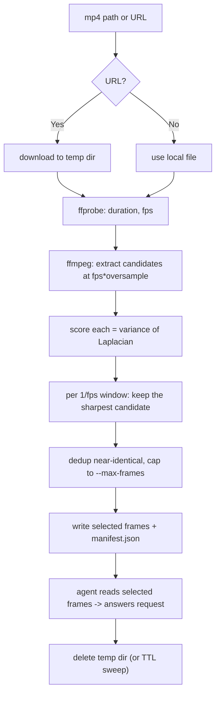

# Review MP4

Turn an mp4 (local path or URL) into a small set of sharp, representative frames, then read those frames with your own vision to answer whatever the user asked about the video.

A self-contained script does the heavy lifting (download, extract, blur-score, select); **you** are the understanding step — you read the selected frames and reason about them. No frame or video is ever uploaded anywhere.

## Prerequisites

- **ffmpeg** and **ffprobe** on PATH (extraction + probing). Stop and ask the user to install ffmpeg if missing.
- A runtime for the blur metric — **Python 3 preferred**, Node.js as fallback (see [Setup](#setup)).
- `curl` for URL downloads (optional; ffmpeg can fetch a URL directly if absent).

## Setup

Set `TOOL` to the script **inside this skill's own directory** (wherever the skill was installed — e.g. `.cursor/skills/`, `.claude/skills/`, `.agents/skills/`). Prefer Python; fall back to Node.

```bash
SKILL_DIR="<this skill's directory>"          # the folder this SKILL.md lives in

# Prefer Python (faster: vectorized numpy, no OpenCV needed)
if command -v python3 >/dev/null 2>&1; then
  RUN="python3 $SKILL_DIR/scripts/review_mp4.py"
  python3 -c "import PIL, numpy" 2>/dev/null || pip install pillow numpy
# Fall back to Node (sharp)
elif command -v node >/dev/null 2>&1; then
  RUN="node $SKILL_DIR/scripts/review_mp4.js"
  [ -d "$SKILL_DIR/scripts/node_modules/sharp" ] || (cd "$SKILL_DIR/scripts" && npm install)
else
  echo "review-mp4 needs python3 or node" >&2
fi
```

- The Python backend auto-uses **OpenCV** if importable (`cv2.Laplacian(...).var()`); otherwise Pillow + numpy. The Node backend uses **sharp**.
- Absolute sharpness values are **not** comparable across backends — selection is relative (sharpest-in-window). See [REFERENCE.md](REFERENCE.md#thresholds).

## How it works



Extracting above the target rate (`--oversample`) and keeping the sharpest frame in each window is the "if the 1s frame is blurry, check its neighbors" behavior, generalized to the whole timeline.

## Workflow

Copy this checklist and track progress:

```
- [ ] Step 1: Resolve runtime + deps, sweep stale temp dirs
- [ ] Step 2: Process the video into selected frames + manifest
- [ ] Step 3: Read the selected frames and answer the request
- [ ] Step 4: (optional) Drill down on a moment at higher fps
- [ ] Step 5: Clean up the temp dir
```

### Step 1: Runtime + cleanup

Follow [Setup](#setup) to pick `$RUN` and ensure deps. `process` runs a TTL sweep automatically, but you can also sweep explicitly:

```bash
$RUN clean --ttl 24h
```

### Step 2: Process the video

```bash
$RUN process "<path-or-url>" --fps 1 --oversample 3 --max-frames 24 --json
```

This downloads (if a URL), extracts candidates, scores sharpness, selects the sharpest frame per 1-second window, dedups, caps to `--max-frames`, and writes `manifest.json` + `frame-NNN-t<seconds>.jpg` into a fresh temp dir. The `--json` line gives you `manifest` and `outdir`.

Read `manifest.json` to get the ordered `selected[]` list (each has `t`, `path`, `sharpness`, `blurry`).

### Step 3: Read frames and answer

Open each `selected[].path` **in timestamp order** with the Read tool (it renders images), then reason about the user's actual request — describe, summarize, find a moment, extract text/UI, etc. **Cite timestamps** (`t`) so the user can jump to them. If a frame is flagged `blurry: true`, treat it as lower-confidence.

### Step 4: Drill down (optional)

For a specific moment or fast action, re-process a slice at a higher rate:

```bash
$RUN process "<path-or-url>" --start 00:01:12 --end 00:01:20 --fps 4 --oversample 4 --json
```

### Step 5: Clean up

Delete the temp dir when done (or rely on the TTL sweep):

```bash
rm -rf "<outdir>"
```

## Key options

| Option | Default | Purpose |
|--------|---------|---------|
| `--fps` | `1` | Target selected frames per second (window size = 1/fps). |
| `--oversample` | `3` | Extract this many candidates per target frame, so a blurry pick has neighbors. |
| `--max-frames` | `24` | Hard cap on selected frames, evenly distributed across the timeline. |
| `--threshold` | backend default | Absolute blur floor; a window's best below it is flagged `blurry`. |
| `--skip-blurry` | off | Drop (don't just flag) windows whose best frame is below threshold. |
| `--start` / `--end` | whole video | Limit to a time range (seconds or `HH:MM:SS`). |
| `--keep-candidates` | off | Keep + record every candidate (debug/tuning). |
| `--backend` | `auto` | Python: `auto`/`opencv`/`numpy`. |
| `--outdir` | fresh temp dir | Write somewhere specific instead of a temp dir. |

## Decision table

| Situation | Action |
|-----------|--------|
| Input is a URL | Pass it directly; the script downloads to the temp dir (`curl`, else ffmpeg). |
| Long video (many minutes) | Keep `--max-frames` modest (e.g. 24-40); rely on even distribution, then drill down. |
| Need a precise moment | Re-run `--start/--end` with higher `--fps`/`--oversample`. |
| Everything comes back `blurry` | Lower `--threshold` (values differ per backend — see REFERENCE), or the source is genuinely soft. |
| Too many near-identical frames | Raise `--dedup-dist`; lower `--fps`. |
| ffmpeg missing | Stop and ask the user to install ffmpeg. |
| Neither python3 nor node | Stop and ask the user to install one. |

## Anti-patterns

- Reading raw candidate frames or the whole temp dir instead of the manifest's `selected[]` — that defeats the blur filter and the frame cap.
- Ignoring `--max-frames` and reading hundreds of frames — it's slow and adds little signal.
- Comparing `sharpness` numbers across backends or videos — the metric is relative; only compare within one run.
- Leaving temp dirs behind — always clean up (or trust the TTL sweep), never write frames into the user's repo.
- Uploading the video or frames to any external service — reading is local, via the Read tool only.
- Treating a `blurry: true` frame as high-confidence ground truth.

## Examples

**Summarize a local screen recording:**

> `$RUN process ~/demo.mp4 --fps 1 --json` -> read the ~20 selected frames -> "0-4s: login screen; 5-9s: dashboard loads; 10-14s: user opens Settings..."

**Answer a question about a URL clip:**

> `$RUN process https://example.com/clip.mp4 --json` -> read frames -> "The error toast appears at t=7.0s and reads 'Connection lost'."

## Resources

- Blur theory, threshold tuning, the selection algorithm, ffmpeg commands, and the manifest schema: [REFERENCE.md](REFERENCE.md)
