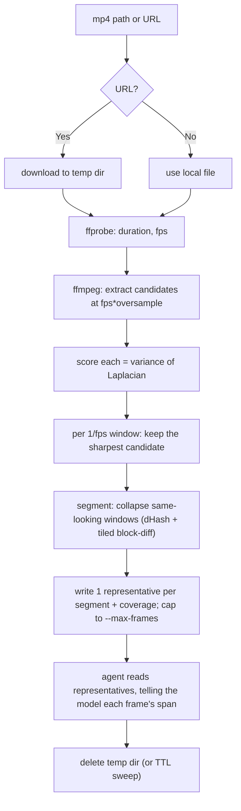

# Review MP4

Turn an mp4 (local path or URL) into a small set of sharp, representative frames, then read those frames with your own vision to answer whatever the user asked about the video.

A self-contained script does the heavy lifting (download, extract, blur-score, select); **you** are the understanding step — you read the selected frames and reason about them. No frame or video is ever uploaded anywhere.

## Prerequisites

- **ffmpeg** and **ffprobe** on PATH (extraction + probing). Stop and ask the user to install ffmpeg if missing.
- A runtime for the blur metric — **Python 3 preferred**, Node.js as fallback (see [Setup](#setup)).
- `curl` for URL downloads (optional; ffmpeg can fetch a URL directly if absent).

## Setup

Set `TOOL` to the script **inside this skill's own directory** (wherever the skill was installed — e.g. `.cursor/skills/`, `.claude/skills/`, `.agents/skills/`). Prefer Python; fall back to Node.

```bash
SKILL_DIR="<this skill's directory>"          # the folder this SKILL.md lives in

# Prefer Python (faster: vectorized numpy, no OpenCV needed)
if command -v python3 >/dev/null 2>&1; then
  RUN="python3 $SKILL_DIR/scripts/review_mp4.py"
  python3 -c "import PIL, numpy" 2>/dev/null || pip install pillow numpy
# Fall back to Node (sharp)
elif command -v node >/dev/null 2>&1; then
  RUN="node $SKILL_DIR/scripts/review_mp4.js"
  [ -d "$SKILL_DIR/scripts/node_modules/sharp" ] || (cd "$SKILL_DIR/scripts" && npm install)
else
  echo "review-mp4 needs python3 or node" >&2
fi
```

- The Python backend auto-uses **OpenCV** if importable (`cv2.Laplacian(...).var()`); otherwise Pillow + numpy. The Node backend uses **sharp**.
- Absolute sharpness values are **not** comparable across backends — selection is relative (sharpest-in-window). See [REFERENCE.md](REFERENCE.md#thresholds).

## How it works



Extracting above the target rate (`--oversample`) and keeping the sharpest frame in each window is the "if the 1s frame is blurry, check its neighbors" behavior, generalized to the whole timeline. **Segmentation** then groups consecutive same-looking windows into one representative frame that covers a time span, so a static 30s intro becomes one image (with `represents`/`duration`) instead of 30 — saving tokens. Sensitivity is controlled by `--profile` (see [below](#choosing-a-profile)).

## Choosing a profile

`--profile` sets how sensitive segmentation is. **You pick it** from the recording type and how fine-grained the question is:

- `screencast` (default): sensitive tiled diff — catches typing, dropdowns, badges, small UI changes on an otherwise-static screen. Use for screen/browser/app recordings, demos, slide walk-throughs, or any question about on-screen text/UI ("what did they type?", "which menu did they open?").
- `video`: coarser — tolerates constant natural motion (camera, b-roll, gameplay) so it does not over-segment and blow the frame budget. Use for filmed/real-world footage where you want scene-level coverage.

When unsure, default to `screencast`. Override individual knobs (`--diff-thresh`, `--min-blocks`, etc.) only for fine-tuning.

## Workflow

Copy this checklist and track progress:

```
- [ ] Step 1: Resolve runtime + deps, sweep stale temp dirs
- [ ] Step 2: Pick --profile, process the video into representative frames + manifest
- [ ] Step 3: Read the representatives and answer, telling the model each frame's span
- [ ] Step 4: (optional) Drill down on a moment at higher fps
- [ ] Step 5: Clean up the temp dir
```

### Step 1: Runtime + cleanup

Follow [Setup](#setup) to pick `$RUN` and ensure deps. `process` runs a TTL sweep automatically, but you can also sweep explicitly:

```bash
$RUN clean --ttl 24h
```

### Step 2: Process the video

```bash
$RUN process "<path-or-url>" --profile screencast --fps 1 --max-frames 24 --json
```

This downloads (if a URL), extracts candidates, scores sharpness, selects the sharpest frame per 1-second window, **collapses consecutive same-looking windows into segments**, caps to `--max-frames`, and writes `manifest.json` + `frame-NNN-t<seconds>.jpg` into a fresh temp dir. The `--json` line gives you `manifest`, `outdir`, and `profile`.

Read `manifest.json` to get the ordered `selected[]` list. Each representative has `t`, `path`, `sharpness`, `blurry`, `range`, plus **coverage**: `segment_start`, `segment_end`, `duration` (seconds the frame stands for), and `represents` (how many frames it collapsed).

To restrict analysis to specific parts of the video, pass one or more `--range LO..HI` (see [Step 4](#step-4-focus-on-time-ranges)).

### Step 3: Read frames and answer

Open each `selected[].path` **in timestamp order** with the Read tool (it renders images), then reason about the user's actual request — describe, summarize, find a moment, extract text/UI, etc. **Cite timestamps** (`t`) so the user can jump to them.

When a representative collapsed several frames (`represents > 1` / `duration` large), treat it as standing for its whole span and **say so** — e.g. "from 0:05 to 0:35 the screen shows the dashboard (one representative frame)". This is the token-saving win: one image answers for the entire static stretch. If a frame is `blurry: true`, treat it as lower-confidence.

### Step 4: Focus on time ranges (optional)

Use `--range LO..HI` to analyze only specific parts of the video. It is **repeatable**, so you can target several disjoint windows in one run, and bounds accept end-relative tokens (`end`, `end-10`) as well as seconds and `HH:MM:SS`. Frames from every range are scored, selected, and capped together; each selected frame records which `range` it came from.

```bash
# First 10s AND last 10s in one run (e.g. "is our logo shown in the intro or outro?")
$RUN process "<path-or-url>" --range 0..10 --range end-10..end --fps 1 --json

# Drill down on one fast moment at a higher rate
$RUN process "<path-or-url>" --range 00:01:12..00:01:20 --fps 4 --oversample 4 --json
```

`--start`/`--end` still work for a single range and also accept end-relative tokens. The bound resolution needs the video duration (from `ffprobe`); if duration is unknown, `end`/`end-N` can't be computed.

### Step 5: Clean up

Delete the temp dir when done (or rely on the TTL sweep):

```bash
rm -rf "<outdir>"
```

## Key options

| Option | Default | Purpose |
|--------|---------|---------|
| `--fps` | `1` | Target selected frames per second (window size = 1/fps). |
| `--oversample` | `3` | Extract this many candidates per target frame, so a blurry pick has neighbors. |
| `--max-frames` | `24` | Hard cap on representatives, evenly distributed across the timeline. |
| `--threshold` | backend default | Absolute blur floor; a window's best below it is flagged `blurry`. |
| `--skip-blurry` | off | Drop (don't just flag) windows whose best frame is below threshold. |
| `--profile` | `screencast` | Segmentation sensitivity preset: `screencast` (sensitive) or `video` (coarse). Sets the knobs below. |
| `--no-segment` | off | Disable segmentation; emit one frame per kept window (old behavior). |
| `--diff-thresh` | per profile | Per-block diff threshold (0-1) for the tiled confirm; lower = more sensitive. |
| `--min-blocks` | per profile | How many changed blocks count as a real change (cursor-jitter floor). |
| `--hash-dist` | per profile | dHash Hamming threshold for the fast prefilter. Alias: `--dedup-dist`. |
| `--block-grid` | per profile | NxN grid over a 64x64 thumbnail for the tiled diff. |
| `--max-segment-seconds` | `0` | Force a fresh representative after this many seconds (0 = unbounded). |
| `--range LO..HI` | whole video | Limit to a time range; **repeatable** for multiple windows. Bounds: seconds, `HH:MM:SS`, `start`, `end`, or end-relative (`end-10`). |
| `--start` / `--end` | whole video | Single-range shorthand; same bound formats as `--range` (including `end-N`). |
| `--keep-candidates` | off | Keep + record every candidate (debug/tuning). |
| `--backend` | `auto` | Python: `auto`/`opencv`/`numpy`. |
| `--outdir` | fresh temp dir | Write somewhere specific instead of a temp dir. |

## Decision table

| Situation | Action |
|-----------|--------|
| Input is a URL | Pass it directly; the script downloads to the temp dir (`curl`, else ffmpeg). |
| Long video (many minutes) | Keep `--max-frames` modest (e.g. 24-40); rely on even distribution, then drill down. |
| Question about specific parts (e.g. first & last 10s) | Pass multiple `--range`, e.g. `--range 0..10 --range end-10..end`. |
| "Last N seconds" / "N seconds before the end" | Use an end-relative bound: `--range end-N..end`. |
| Need a precise moment | Re-run a single `--range` with higher `--fps`/`--oversample`. |
| Everything comes back `blurry` | Lower `--threshold` (values differ per backend — see REFERENCE), or the source is genuinely soft. |
| Browser/app/screen recording | Use `--profile screencast` (default) so typing and menus each get a frame. |
| Filmed/real-world footage over-segmenting | Use `--profile video` (coarser), or raise `--diff-thresh` / `--min-blocks`. |
| Localized UI change (typing) being merged | Lower `--diff-thresh` or `--min-blocks`. |
| Too many near-identical frames | Use `--profile video`, raise `--diff-thresh`/`--min-blocks`/`--hash-dist`, or lower `--fps`. |
| Want every window, no collapsing | `--no-segment`. |
| ffmpeg missing | Stop and ask the user to install ffmpeg. |
| Neither python3 nor node | Stop and ask the user to install one. |

## Anti-patterns

- Reading raw candidate frames or the whole temp dir instead of the manifest's `selected[]` — that defeats the blur filter, segmentation, and the frame cap.
- Reading a collapsed representative but not telling the model it covers a span (`duration`/`represents`) — you lose the timeline context the model needs.
- Using `--profile video` for a screen recording — small UI changes (typing, menus) get merged away.
- Ignoring `--max-frames` and reading hundreds of frames — it's slow and adds little signal.
- Comparing `sharpness` numbers across backends or videos — the metric is relative; only compare within one run.
- Leaving temp dirs behind — always clean up (or trust the TTL sweep), never write frames into the user's repo.
- Uploading the video or frames to any external service — reading is local, via the Read tool only.
- Treating a `blurry: true` frame as high-confidence ground truth.

## Examples

**Summarize a local screen recording (segments collapse static stretches):**

> `$RUN process ~/demo.mp4 --profile screencast --fps 1 --json` -> read the representatives -> "0-5s: login screen (1 frame, ~5s); 5-35s: dashboard idle (1 frame covers 30s); 35-38s: Settings opens..."

**Browsing session (localized changes each get a frame):**

> `$RUN process ~/session.mp4 --profile screencast --json` -> "t=3s: empty search box; t=6s: typed 'invoices'; t=8s: results dropdown" — typing and the dropdown each became their own segment.

**Answer a question about a URL clip:**

> `$RUN process https://example.com/clip.mp4 --json` -> read frames -> "The error toast appears at t=7.0s and reads 'Connection lost'."

**Check the intro and outro only (multi-range + end-relative):**

> `$RUN process ~/promo.mp4 --range 0..10 --range end-10..end --json` -> read the range-0 and range-1 frames -> "The codebase logo is visible in the first 10s (t=2-6s, range 0) but not in the last 10s (range 1)."

## Resources

- Blur theory, threshold tuning, the selection algorithm, ffmpeg commands, and the manifest schema: [REFERENCE.md](REFERENCE.md)
