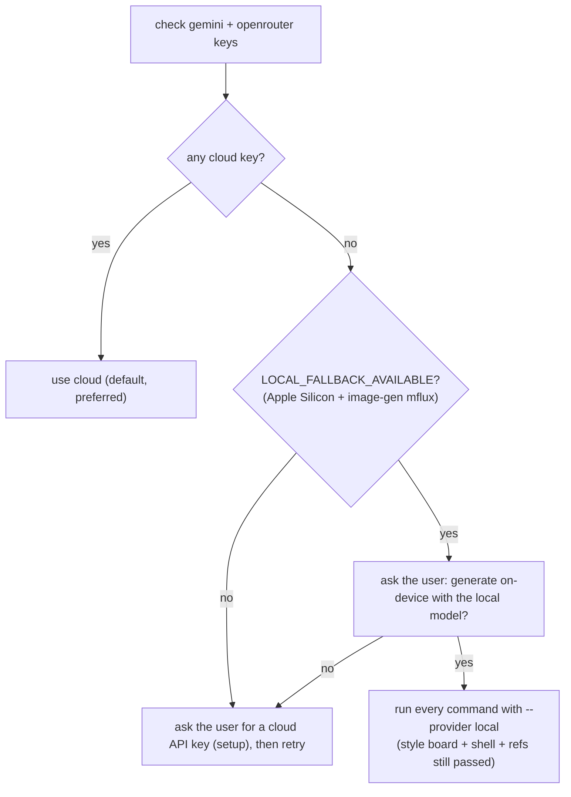

# ForwardPath Web UI

Two deliverables from a SOW and/or an existing codebase, for a **Next.js (App Router) + Tailwind** web app:

1. **A grounded screen spec** (`WEB_APP_SCREENS_SPEC.md`) — brand foundation + app shell + every required screen, grounded on the SOW and (when available) the real codebase.
2. **Consistent desktop mockups** — a brand **style board**, one **app-shell** reference, and one landscape image per screen, via Google Gemini.

The credibility trick: every screen inherits the **same style board and the same app shell (top nav / sidebar / logo)**, so the set reads as one real product instead of unrelated pictures.

This skill is self-contained. PDF/report generation is out of scope.

## Hard rules
- **Ground the brand.** If a Next.js + Tailwind repo is available, extract the brand from code (see [`BRAND_EXTRACTION.md`](BRAND_EXTRACTION.md)). Otherwise research the SOW-named entities. Never invent a brand when a real one exists.
- **Ground the features.** Depict and spec only SOW-documented web capabilities. List anything inferred under an Appendix and exclude it from mockups unless the user confirms.
- **One product.** Every screen reuses the approved style board and app shell. Nav items, their order, the logo, and the active-state treatment stay identical across screens.
- **Web-feasible.** Every screen must map to Next.js App Router + Tailwind (and shadcn/ui where present) — see [`NEXT_TAILWIND.md`](NEXT_TAILWIND.md). Don't draw native-mobile widgets.
- **Desktop landscape.** Mockups are `16:9` landscape unless the user asks otherwise. Show your work: after each image, display it with the Read tool.

## Setup (once per machine)

Dependencies:
```bash
pip install Pillow              # always required
pip install google-genai       # only for --provider gemini (default)
```
The `openrouter` provider needs no extra package (it uses the Python stdlib).

**Provider.** The tool renders through one of three backends, selected with `--provider` (or the `WEB_UI_PROVIDER` env var, or the stored default):
- `gemini` (default) — Google Gemini API directly. Key from https://aistudio.google.com/apikey (`GEMINI_API_KEY` / `GOOGLE_API_KEY`).
- `openrouter` — OpenRouter's OpenAI-compatible API. Key from https://openrouter.ai/keys (`OPENROUTER_API_KEY`). `image_config` (aspect ratio + size) is forwarded to Gemini image models, so landscape control is preserved. Pass `--provider openrouter` to **every** command below.
- `local` — **on-device fallback, no API key.** Reference-capable FLUX.2 Klein Edit (or Qwen-Image-Edit) run through the separately-installed [`image-gen`](../image-gen) skill's `mflux` CLIs. Apple Silicon only. Cloud stays preferred; only use `local` when there's no cloud key **and** the user consents — see [No cloud key? On-device fallback](#no-cloud-key-on-device-fallback). Needs `image-gen` set up once: `bash <image-gen>/scripts/setup_env.sh`.

Set `TOOL` to the absolute path of `scripts/webmock_gen.py` **inside this skill's own directory** (the folder this `SKILL.md` lives in — wherever the skill was installed, e.g. `.cursor/skills/`, `.claude/skills/`, or `.agents/skills/`). Reuse this `$TOOL` for every command below.

API key — check, and if missing, **ask the user** for the chosen provider's key, then store it. Pass the key via **stdin** (not `--api-key`) so it never appears in `ps`/`/proc`:
```bash
TOOL="<this skill dir>/scripts/webmock_gen.py"
python "$TOOL" check                               # add --provider openrouter to target that backend
# If NOT_CONFIGURED, ask the user for the key, then store it via stdin:
printf '%s' "USER_KEY_HERE" | python "$TOOL" setup            # gemini (default)
printf '%s' "USER_KEY_HERE" | python "$TOOL" setup --provider openrouter
# Alternatively, skip setup entirely and export GEMINI_API_KEY (or OPENROUTER_API_KEY).
```
Keys persist per provider at `~/.config/web-ui/config.json`. If any call prints `NO_API_KEY`, ask the user for a key and run `setup`, then retry. Never hardcode a key.

### No cloud key? On-device fallback

When the user has **no** Gemini/OpenRouter key, this machine can generate mockups fully offline — but only on an Apple Silicon Mac, and only with the user's consent. The generator never falls back silently: `local` runs solely via an explicit `--provider local`. Follow this flow:



1. Run `python "$TOOL" check`. It prints the cloud key status **and** a `LOCAL_FALLBACK_AVAILABLE` / `LOCAL_FALLBACK_UNAVAILABLE (reason)` line.
2. If no cloud key but `LOCAL_FALLBACK_AVAILABLE`, **ask the user** (via the chat, e.g. the question/approval UI) whether to generate on-device. Explain the trade-offs honestly (below). Only proceed on a yes.
3. On consent, add `--provider local` to **every** `generate`/`regenerate` call. Keep the same strict order (style board → shell → screens) and keep passing `--refs` (style board, shell, prior screens) — references are forwarded to the edit model (`--image-paths`), so the one-product look and shared chrome are preserved.
4. Optionally persist it as the default: `python "$TOOL" setup --provider local` (no key needed; `--local-model flux2-klein-4b|qwen-image-edit` to pin the engine).

The engine auto-picks: **Qwen-Image-Edit** if its weights are already cached, otherwise **FLUX.2 Klein Edit** (`flux2-klein-4b`, the lighter default). First run downloads weights (~12 GB free needed) into the shared HF cache.

**Honest limitations of the local path** (tell the user):
- References **are** used, so brand/chrome consistency holds up far better than plain text-to-image — but still below Gemini's reference fidelity, and an edit model can drift on complex, chrome-heavy web layouts.
- Diffusion renders small UI text (nav labels, table cells) less crisply than Gemini. It's a solid "better-than-nothing" fallback, not a Gemini replacement.
- Slower (on-device), and needs the `image-gen` skill installed on Apple Silicon.

**analyze / modify-json with no cloud key.** In local mode these default to **agent-native** — the fastest, highest-quality path: running `analyze`/`modify-json --provider local` prints a `LOCAL_ANALYZE_AGENT_NATIVE` / `LOCAL_MODIFY_AGENT_NATIVE` directive, and **you (the agent) then read the mockup with the Read tool and write/edit the JSON yourself** (no model download, fully offline). Only add `--vlm` if a scripted, offline model is required instead of doing it inline — that needs a one-time `bash "$(dirname "$TOOL")/setup_vlm.sh"` (creates a shared `~/.ui-vlm` venv; default VLM `Qwen2.5-VL-3B`, override with `--vlm-model`).

---

## Phase 1 — SOW / codebase → grounded screen spec

Copy this checklist and track it:
```
- [ ] 1. Ingest the SOW
- [ ] 2. Locate the codebase (or confirm none) and extract the brand
- [ ] 3. Define the app shell (nav / sidebar / logo / user menu)
- [ ] 4. Map required features to Next.js + Tailwind
- [ ] 5. Enumerate required screens (grounded, in usage order)
- [ ] 6. Write WEB_APP_SCREENS_SPEC.md from the template
```

**1. Ingest the SOW.** Accept a URL or a file. For a URL, fetch it; if it's JavaScript-rendered (e.g. Notion) and comes back empty, use a browser tool to read the rendered text. Capture objectives, scope, roles, features, data, integrations, constraints, phasing.

**2. Locate the codebase and extract the brand.** Ask for or detect a Next.js + Tailwind repo path. If one exists, follow [`BRAND_EXTRACTION.md`](BRAND_EXTRACTION.md) to pull real tokens (Tailwind theme, CSS variables), fonts (`next/font`), logos (`public/`), and the existing shell components. If no repo exists, research the SOW-named entities' brands with web tools (same approach as the `mobile-ui` skill). This becomes §1 of the spec.

**3. Define the app shell.** Identify the persistent chrome that must not drift: top nav (items + order + active state), sidebar (groups + items), logo placement, breadcrumbs, global search, user/account menu. Transcribe real labels. This becomes §2 of the spec and later the `00-shell` mockup.

**4. Map features to Next.js + Tailwind.** For each web capability (auth, data tables, forms, charts, file upload, real-time, etc.), pick the App Router + Tailwind (+ shadcn/ui) path from [`NEXT_TAILWIND.md`](NEXT_TAILWIND.md). Flag anything not feasible.

**5. Enumerate required screens.** Derive the minimal set of web screens to deliver the SOW, in **usage order** (auth/first-run → core loop → detail/reporting → account/settings). Each screen traces to a SOW section (or is marked `implied`/`inferred`).

**6. Write the spec.** Create `WEB_APP_SCREENS_SPEC.md` using [`SPEC_TEMPLATE.md`](SPEC_TEMPLATE.md): brand foundation, app shell, information architecture, screen inventory table, and a definition block per screen (purpose, layout by content region, components, states, primary action, Next.js/Tailwind mapping, SOW basis). Include the grounding rule and an Appendix of inferred/out-of-scope items.

Confirm the spec with the user before generating mockups.

---

## Phase 2 — generate the mockups

Tool: the `$TOOL` set in Setup. Prompting recipes and the project-file format are in [`MOCKUP_PROMPTING.md`](MOCKUP_PROMPTING.md). Generate in this **strict order** so consistency compounds:

```
- [ ] 1. Write .forwardpath-webui-project.json (brand, colors, style, chrome, render)
- [ ] 2. Generate 00-style-board.png; show it; iterate until the user approves
- [ ] 3. Generate 00-shell.png (nav + sidebar + empty canvas); refs: style board (+ real logo)
- [ ] 4. Generate screens one per call, in usage order, into mockups/
- [ ] 5. Pass style board + shell + 2-3 prior screens as refs; restate chrome copy verbatim
- [ ] 6. Audit the full set for consistency + grounding; regenerate drift
```

**1. Project file.** Write `.forwardpath-webui-project.json` at the workspace root (format in [`MOCKUP_PROMPTING.md`](MOCKUP_PROMPTING.md)) so every generation reuses the same brand, chrome, and render settings.

**2. Style board (the master anchor).** Generate `mockups/00-style-board.png` with `--kind style-board` (palette swatches, type samples, button/input/card states, logo lockup). Pass real logo files via `--refs` when extracted from `public/`. Show it and iterate — **everything downstream inherits it**, so get approval before continuing.

**3. App shell.** Generate `mockups/00-shell.png` with `--kind shell` — the top nav, sidebar, logo, and an empty content canvas, using the exact chrome copy from the spec. Refs: the approved style board (+ logo).

**4-5. Screens.** One screen per call, in usage order, saved as `mockups/NN-screen-name.png`:
```bash
python "$TOOL" generate --kind screen \
  --prompt "<screen identity; then the SAME shell restated verbatim; then content-region layout left→right / top→bottom; real labels; primary action; what to omit>" \
  --theme light \
  --colors "<palette from project file>" \
  --style "<style from project file>" \
  --description "<brand context from project file>" \
  --refs mockups/00-style-board.png mockups/00-shell.png mockups/01-*.png logo.svg \
  -o mockups/02-<name>.png
```
Always pass the style board and shell via `--refs`, plus the 2-3 most representative prior screens, and **restate the chrome copy verbatim** in the prompt. Defaults are landscape `16:9`, `2K`, `browser` frame (override with `--frame macbook|none`, `--aspect`, `--size`). Show each image with the Read tool and append it to the project file's `screens` array.

**6. Audit.** Re-check the set: same nav items/order/logo/active-state on every screen; no invented features; Next.js/Tailwind-feasible. Regenerate any drift (retry once; if needed lower `--temperature` or simplify the prompt).

### Editing an existing mockup (optional)
Use the 3-step flow: `analyze` -> `modify-json` -> `regenerate` (keeps layout, applies only requested changes). See script `--help`. With `--provider local`, `analyze`/`modify-json` are agent-native by default (you read the image and write the JSON), while `regenerate --provider local` re-renders on-device, forwarding `--original` + `--refs` to the edit model.

---

## Command reference
Every command accepts `--provider gemini|openrouter|local` (default `gemini`). For `local`, the engine auto-picks Qwen-Image-Edit if cached else `flux2-klein-4b` (force with `--model flux2-klein-4b|qwen-image-edit`); no key is required.
```bash
python "$TOOL" check [--provider gemini|openrouter|local]   # also prints LOCAL_FALLBACK_AVAILABLE/UNAVAILABLE
printf '%s' KEY | python "$TOOL" setup [--provider gemini|openrouter] [--generation-model M] [--analysis-model M]
python "$TOOL" setup --provider local [--local-model flux2-klein-4b|qwen-image-edit]   # no key needed
python "$TOOL" generate --kind style-board|shell|screen --prompt "..." -o out.png [--provider ...] [--model ...] [--refs ...] [--colors ...] [--style ...] [--description ...] [--theme light|dark] [--frame browser|macbook|none] [--aspect 16:9] [--size 1K|2K|4K] [--temperature 0.35]
python "$TOOL" analyze image.png [-o spec.json] [--provider ...] [--vlm] [--vlm-model M]
python "$TOOL" modify-json --json-file spec.json --changes "..." [-o spec2.json] [--provider ...] [--vlm] [--vlm-model M]
python "$TOOL" regenerate [--kind ...] --json-spec spec2.json [--original image.png] [--refs ...] -o out.png [--provider ...]
```
With `--provider local`, `analyze`/`modify-json` are agent-native by default (they print a directive; you write the JSON). `--vlm` runs a fully-offline model instead and needs a one-time `bash "$(dirname "$TOOL")/setup_vlm.sh"`.

## Resources
- [`BRAND_EXTRACTION.md`](BRAND_EXTRACTION.md) — pull a real brand + app shell out of a Next.js + Tailwind codebase (with the SOW fallback).
- [`SPEC_TEMPLATE.md`](SPEC_TEMPLATE.md) — the web screen-spec Markdown template (brand foundation + app shell + per-screen blocks).
- [`MOCKUP_PROMPTING.md`](MOCKUP_PROMPTING.md) — style-board / shell / screen prompt recipes + `.forwardpath-webui-project.json` format.
- [`NEXT_TAILWIND.md`](NEXT_TAILWIND.md) — capability -> Next.js/Tailwind/shadcn map and feasibility constraints.
